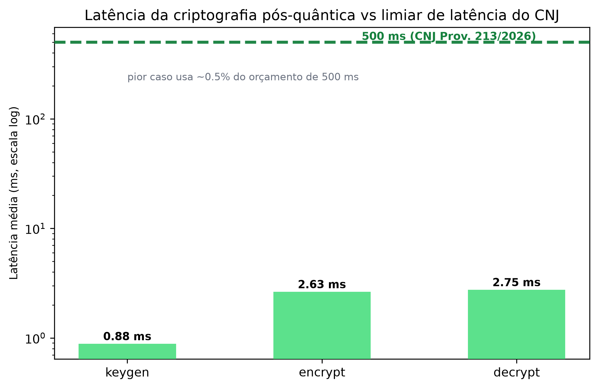
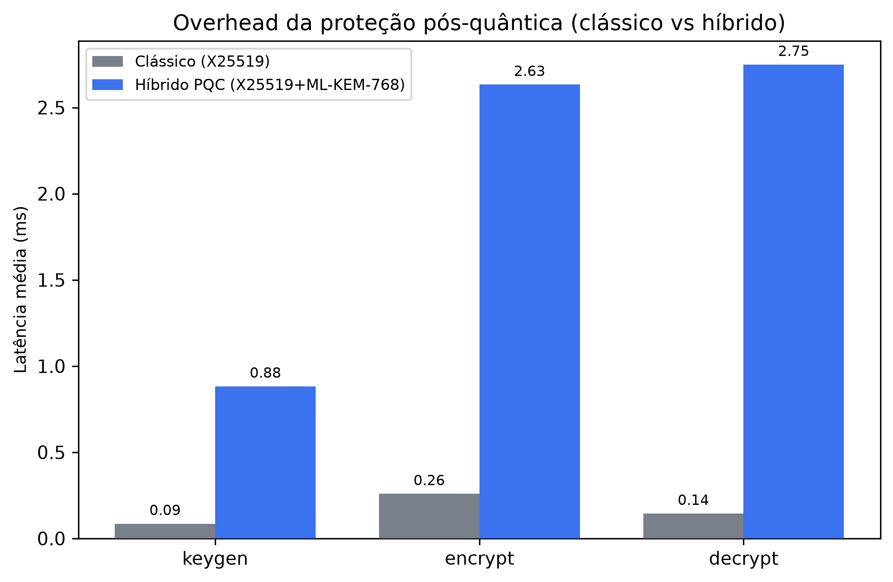
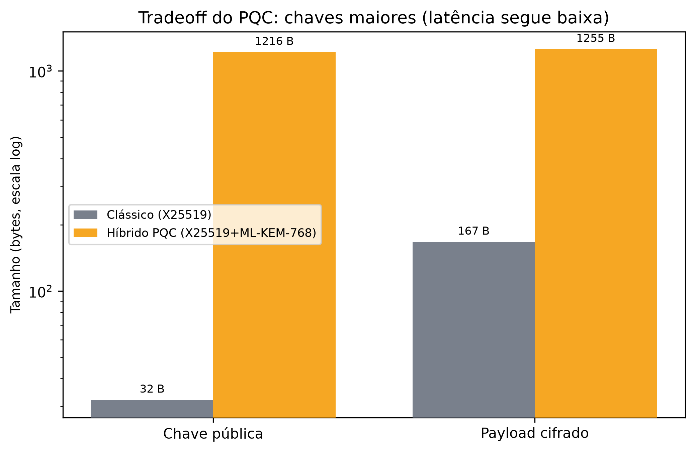
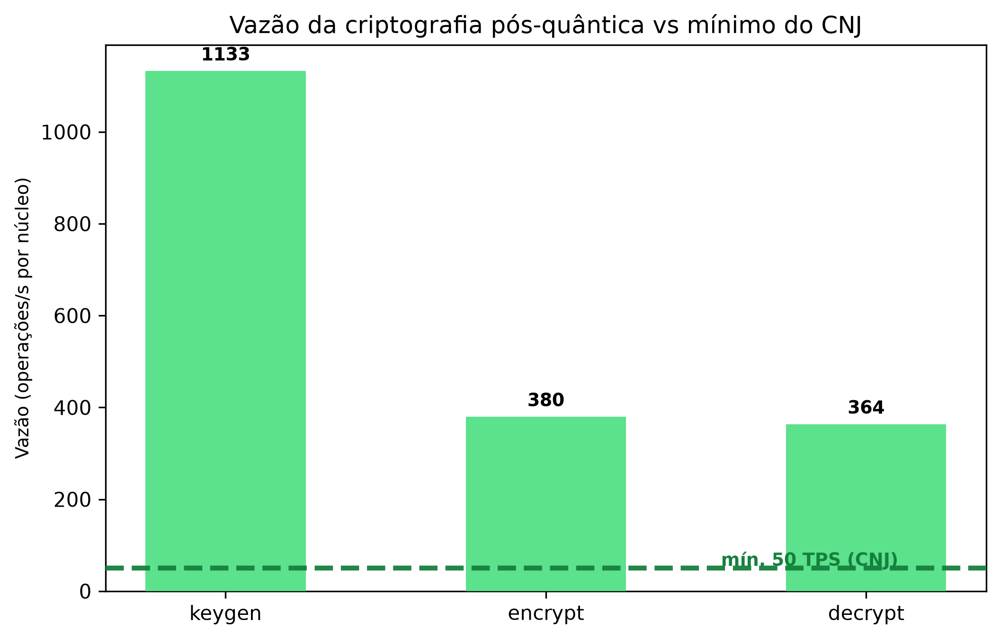

# Benchmark de desempenho — camada ViewKey pós-quântica

Medição da latência e vazão da criptografia híbrida **X25519 + ML-KEM-768 (X-Wing) + AES-256-GCM** que
protege a PII do signatário (`api/src/viewkey.ts`). Objetivo: evidenciar **folga de desempenho** compatível
com a alta disponibilidade exigida pelas normas do e-notariado do CNJ (Prov. 100/2020, 149/2023, 213/2026).

> Honestidade: não há SLA numérico de latência cripto no CNJ (as normas tratam de **disponibilidade**,
> redundância e continuidade). Este é um **micro-benchmark** de folga, não um SLA certificado nem um teste
> de carga distribuído.

## Qual "ferramenta" capturou os tempos
**Nenhum framework de bench externo.** É um script Node próprio (`api/src/viewkey.bench.ts`) que usa o
**timer de alta resolução do próprio runtime — `performance.now()`** (API `perf_hooks`, precisão de
sub-milissegundo). Por quê: a dependência já é zero, o timer é o mesmo que libs de bench usam por baixo, e
mantém o teste auditável e reproduzível sem adicionar nada ao `package.json`.

Como funciona, em resumo:
1. **Warmup** — uma execução de keygen→encrypt→decrypt antes de medir, para carregar o KEM (dynamic import
   do `@noble/post-quantum`, que é ESM) e aquecer o JIT do V8.
2. **N = 500 iterações** por operação (keygen, encrypt, decrypt), cada uma cercada por `performance.now()`.
3. **Estatística** — avg, **p50/p95/p99**, min, max e vazão (ops/s = 1000/avg). Percentis vêm da lista
   ordenada das 500 amostras.

## Ambiente da medição de referência
| Item | Valor |
|---|---|
| Node.js | v24.16.0 |
| ts-node | v10.9.2 |
| CPU | Intel Core i5-11300H @ 3.10 GHz — 4 núcleos físicos / 8 lógicos |
| RAM | 23,8 GB |
| SO | Windows 11 Home (10.0.26200) |
| Lib cripto | `@noble/post-quantum` 0.7.1 (pure-JS) + `crypto` nativo do Node (AES-256-GCM, HKDF) |

## Resultados (uma execução de referência, N=500)
| Operação | avg | p50 | p95 | p99 | min | max | vazão |
|---|---|---|---|---|---|---|---|
| keygen  | 1,02 ms | 0,87 ms | 1,61 ms | 2,74 ms | 0,70 ms | 18,71 ms | ~977 ops/s |
| encrypt | 3,09 ms | 2,80 ms | 4,54 ms | 4,96 ms | 2,29 ms | 5,57 ms | ~324 ops/s |
| decrypt | 3,41 ms | 3,00 ms | 5,15 ms | 6,48 ms | 2,48 ms | 16,33 ms | ~293 ops/s |

**Custo cripto por documento** (keygen + encrypt) ≈ **4,1 ms** → ~**243 documentos/s por núcleo**. O `max`
elevado isolado (keygen/decrypt) é ruído de GC/agendamento do SO — o p95/p99 mostram o comportamento real.

Barra de responsividade interna do script: **p95 < 50 ms/op** (passou folgado nos três). É um limite nosso,
generoso, não um número do CNJ.

## Como reproduzir
```powershell
cd C:\Projetos\cartoriochain\code\api
npm install                      # garante @noble/post-quantum
npx ts-node src/viewkey.bench.ts
```
Saída: as três linhas de estatística + a barra de responsividade + custo por documento. Para variar a
carga, ajuste `const N` no topo de `src/viewkey.bench.ts`. Os números variam por máquina/execução; use o
mesmo host para comparações.

## Leitura / conclusão
A troca de criptografia clássica por **híbrida pós-quântica** mantém a latência na casa de **poucos
milissegundos** — imperceptível no fluxo de registro (que é dominado por rede, armazenamento no Irys e
confirmação on-chain). Ou seja: a proteção pós-quântica **não** custa responsividade, e sobra folga para
operação contínua/alta disponibilidade.

## Comparativo visual (clássico vs pós-quântico)

Gráficos gerados no mesmo estilo da suíte de benchmark do TCC (matplotlib, DPI 300, limiares do CNJ
Prov. 213/2026: ≤500 ms, ≥50 TPS). Dados reais medidos — clássico = esquema ECIES X25519 que o projeto
usava antes do PQC; híbrido = X25519 + ML-KEM-768 atual.

**Latência da cripto pós-quântica vs limiar de latência do CNJ (500 ms)** — pior caso usa ~0,5% do orçamento:



**Overhead da proteção pós-quântica (clássico vs híbrido)** — o PQC adiciona poucos milissegundos:



**Tradeoff do PQC — chaves maiores** (chave pública 32 B → 1216 B), latência segue baixa:



**Vazão vs mínimo do CNJ (50 TPS)** — folga de capacidade por núcleo:



### Como regenerar os gráficos
```powershell
cd C:\Projetos\cartoriochain\code
npx ts-node api/src/viewkey.compare-bench.ts   # mede clássico vs híbrido -> docs/benchmark-data.json
pip install matplotlib                          # uma vez
python scripts/plots/plot_benchmark.py          # le o JSON -> docs/img/*.png (estilo TCC)
```
Dados brutos versionados em [`benchmark-data.json`](./benchmark-data.json). Script de plot em
`scripts/plots/plot_benchmark.py` (paleta e limiares CNJ espelhados de `caliper/benchmark_suite/config.py`
do TCC).

## Relacionados
- Testes de corretude/segurança: `api/src/viewkey.test.ts` (8/8), `api/src/viewkey.security.test.ts` (10/10).
- Mapa de fontes e ameaças: [`seguranca-vulnerabilidades-pesquisa.md`](./seguranca-vulnerabilidades-pesquisa.md).
