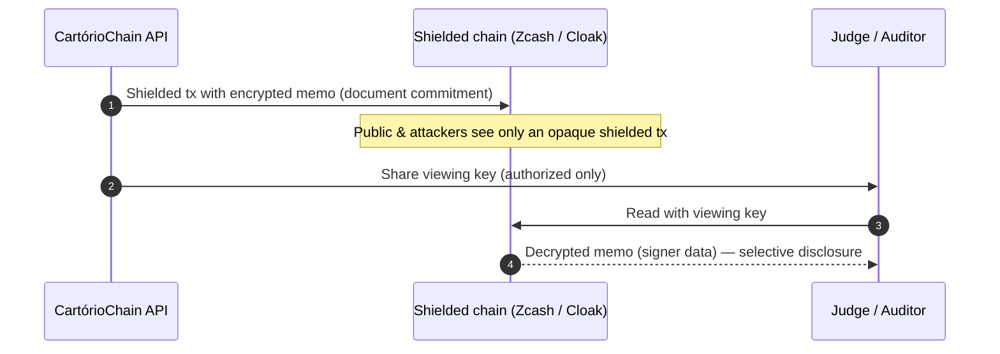

# Privacy on-chain — technical deep-dive

Full technical study behind our privacy design: how shielded transactions, viewing keys and encrypted
memos deliver **selective disclosure**, the two ways to access the chain, and why Cloak (Solana) is our
shipping path. (Decision summary: [`zcash-integration-pivot.md`](./zcash-integration-pivot.md).)

---

## The property we need: selective disclosure

A notary needs the opposite of "all public" and the opposite of "all private": the signer's data must be
**unreadable to the world and readable to an authorized auditor**. In crypto terms:

- **Shielded transaction** — a private transaction. A **zk-SNARK** proves it is valid while hiding sender,
  recipient, amount and memo from every observer.
- **Encrypted memo** — a field (up to 512 bytes on Zcash) carried inside a shielded transaction, encrypted
  on-chain. This is where the document's commitment / signer data goes.
- **Viewing key** — a read-only key. The holder can **decrypt and read** a given account's transactions
  (including memos) **without being able to spend**. Share it with a judge → they audit. Withhold it from a
  hacker → they see nothing.

That combination — opaque by default, readable with the viewing key — *is* "privacy without impunity".

## Glossary

| Term | Meaning |
|---|---|
| Shielded tx | Private transaction; hides sender/receiver/amount/memo via zk-SNARK |
| zk-SNARK | Zero-knowledge proof that validates a tx without revealing its data |
| Encrypted memo | Encrypted data field inside a shielded tx (≤512 bytes on Zcash) |
| Viewing key | Read-only key: see transactions & memos, cannot spend |
| Note | A shielded "UTXO" — a unit of value at a shielded address |
| Commitment | On-chain hash binding a note/record |
| Nullifier | Marks a note spent (prevents double-spend) without revealing the value |
| lightwalletd | Server that feeds "compact blocks" to light clients (no full-node sync) |
| Shielded UTXO | The model both Zcash and Cloak use for private balances |

## Flow (selective disclosure)

## Two ways to access the chain

| | Full node | Light client |
|---|---|---|
| What it does | Downloads & validates the entire chain | Pulls only the wallet's notes via a `lightwalletd` server |
| Trust | Validates consensus itself | Trusts the server for chain data (keys stay local) |
| Speed | Slow (full sync) | Fast (minutes) |
| When to use | Production (max trust + metadata privacy) | Dev / fast integration |

Both produce the **same real on-chain shielded transaction** — the light client is just a lighter way in.

## Why Cloak (Solana) is our shipping path

[`Cloak`](https://docs.cloak.ag) (`@cloak.dev/sdk`) is a Solana-native privacy stack: shielded UTXO +
zk-SNARK + **viewing keys with a compliance pathway** (an entity opens its history to an auditor without
exposing others). Same selective-disclosure guarantee as Zcash, delivered through a **TypeScript SDK** that
fits our Node backend, on **Solana** (our strongest track), with **no faucet dependency**. The direct Zcash
path stays documented and resumable as a bonus toward the Zcash track.

## Post-quantum note

Because CartórioChain stores records **permanently**, the privacy layer is on our post-quantum roadmap
("harvest-now, decrypt-later"): a hybrid **X25519 + ML-KEM (Kyber)** key exchange for the signer-data
encryption. Roadmap, not shipped — it converges with the founder's thesis on post-quantum cryptography.
